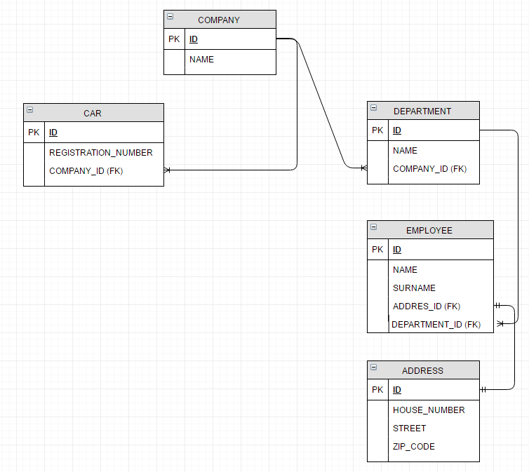
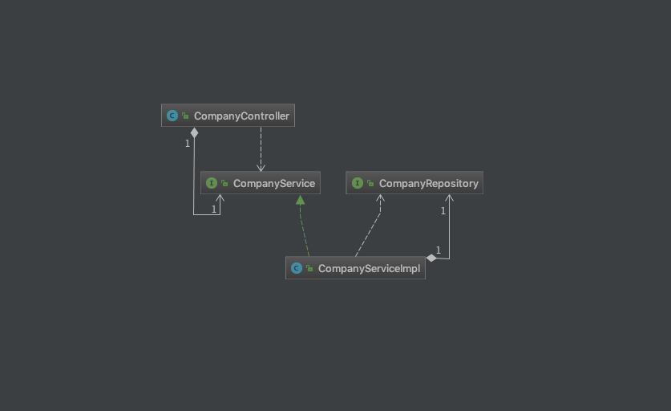

:toc:
:icons: font
:source-highlighter: prettify
:project_id: gs-securing-web
This guide walks you through the process of creating a simple web application with resources that are protected by Spring Security.

== What you'll build

You'll build the secured Restfull apis

== What you'll need

:java_version: 1.8
Spring security architecture

include::https://spring.io/guides/topicals/spring-security-architecture/[]

How to build the secure Rest apis using oauth2

include::https://dzone.com/articles/secure-spring-rest-with-spring-security-and-oauth2[]

We also use liquibase to manage the database changelog

[source,java]
----
<dependency>
    <groupId>org.liquibase</groupId>
    <artifactId>liquibase-core</artifactId>
</dependency>
----

== Create an unsecured web application

Before you can apply security to a web application, you need a web application to secure. The steps in this section walk you through creating a very simple web application. Then you secure it with Spring Security in the next section.

The web application includes the rest apis. CRUD for the companies

In order to build the Rest apis, we follow the class diagram below:

=== Resource layer
* *Source*

`src/main/java/com/qph/resources/CompanyController.java`

ResponseEntity for the api return type to specify the body, header, and HttpStatusCode

include::https://docs.spring.io/spring-framework/docs/current/javadoc-api/org/springframework/http/ResponseEntity.html[]

[source,java]
----
@RequestMapping(method = RequestMethod.POST, produces = MediaType.APPLICATION_JSON_VALUE)
public ResponseEntity<?> create(@RequestBody Company company) {
    companyService.create(company);
    HttpHeaders headers = new HttpHeaders();
    ControllerLinkBuilder linkBuilder = linkTo(methodOn(CompanyController.class).get(company.getId()));
    headers.setLocation(linkBuilder.toUri());
    return ResponseEntity.created(linkBuilder.toUri()).headers(headers).build();
}
----

* *Exception handling*

@ControllerAdvice is used to handle the global exception throwing by @Controller class

[source,java]
----
@ControllerAdvice
public class ResourceNotFoundAdvice {

    @ResponseBody
    @ExceptionHandler(ResourceNotFoundException.class)
    ResponseEntity resourceNotFoundHandler(ResourceNotFoundException ex)
    {
        HttpHeaders headers = new HttpHeaders();
        headers.add("reason", ex.getMessage());
        return ResponseEntity.notFound().headers(headers).build();
    }
}
----
* *Test*

We use `org.springframework.test.web.servlet.MockMvc` to test the rest apis

`mockMvc = MockMvcBuilders.standaloneSetup(companyController).build();` instantiating the rest api by using
MockMvcBuilders.standaloneSetup. This is just to test the CompanyController itself. For the exception handling we use
spring context instead

`Ex testing POST method`
[source,java]
----
mockMvc.perform(post("/secured/company")
                    .contentType(MediaType.APPLICATION_JSON)
                    .content(objectMapper.writeValueAsString(inputCompany))
        )
        .andExpect(status().isCreated());
----
`Testing GET method`
[source,java]
----
mockMvc.perform(get("/secured/company/{id}", companyId))
            .andExpect(status().isOk())
            .andExpect(content().json("{id:100,name:aName}"));
----

=== Service layer
=== Dao layer

[[initial]]
== Set up Spring Security

Suppose that you want to prevent unauthorized users from viewing the greeting page at "/hello". As it is now, if users click the link on the home page, they see the greeting with no barriers to stop them. You need to add a barrier that forces the user to sign in before seeing that page.

You do that by configuring Spring Security in the application. If Spring Security is on the classpath, then Spring Boot {SpringBootSecurity}[automatically secures all HTTP endpoints] with "basic" authentication. But you can further customize the security settings. The first thing you need to do is add Spring Security to the classpath.

With Gradle this would be one line in the `dependencies` closure:

`build.gradle`
[source,java]
----
dependencies {
    ...
include::complete/build.gradle[tag=security]
    ...
}
----

With Maven this would be an extra entry added to `<dependencies>`:

`pom.xml`
[source,zml]
----
<dependencies>
    ...
include::complete/pom.xml[tag=security]
    ...
</dependencies>
----

Here's a security configuration that ensures that only authenticated users can see the secret greeting:

`src/main/java/hello/WebSecurityConfig.java`
[source,java]
----
include::complete/src/main/java/hello/WebSecurityConfig.java[]
----

The `WebSecurityConfig` class is annotated with `@EnableWebSecurity` to enable Spring Security's web security support and provide the Spring MVC integration. It also extends `WebSecurityConfigurerAdapter` and overrides a couple of its methods to set some specifics of the web security configuration.

The `configure(HttpSecurity)` method defines which URL paths should be secured and which should not. Specifically, the "/" and "/home" paths are configured to not require any authentication. All other paths must be authenticated.

When a user successfully logs in, they will be redirected to the previously requested page that required authentication. There is a custom "/login" page specified by `loginPage()`, and everyone is allowed to view it.

As for the `userDetailsService()` method, it sets up an in-memory user store with a single user. That user is given a username of "user", a password of "password", and a role of "USER".

Now we need to create the login page. There's already a v
iew controller for the "login" view, so you only need to create the login view itself:

`src/main/resources/templates/login.html`
[source,html]
----
include::complete/src/main/resources/templates/login.html[]
----

As you can see, this Thymeleaf template simply presents a form that captures a username and password and posts them to "/login". As configured, Spring Security provides a filter that intercepts that request and authenticates the user. If the user fails to authenticate, the page is redirected to "/login?error" and our page displays the appropriate error message. Upon successfully signing out, our application is sent to "/login?logout" and our page displays the appropriate success message.

Last we need to provide the user a way to display the current username and Sign Out. Update the `hello.html` to say hello to the current user and contain a "Sign Out" form as shown below

`src/main/resources/templates/hello.html`
[source,html]
----
include::complete/src/main/resources/templates/hello.html[]
----

We display the username by using Spring Security's integration with `HttpServletRequest#getRemoteUser()`. The "Sign Out" form submits a POST to "/logout". Upon successfully logging out it will redirect the user to "/login?logout".

[[run_the_app]]
== Make the application executable

Although it is possible to package this service as a traditional _web application archive_ or link:/understanding/WAR[WAR] file for deployment to an external application server, the simpler approach demonstrated below creates a _standalone application_. You package everything in a single, executable JAR file, driven by a good old Java `main()` method. And along the way, you use Spring's support for embedding the link:/understanding/Tomcat[Tomcat] servlet container as the HTTP runtime, instead of deploying to an external instance.

`src/main/java/hello/Application.java`
[source,java]
----
include::complete/src/main/java/hello/Application.java[]
----

include::https://raw.githubusercontent.com/spring-guides/getting-started-macros/master/spring-boot-application.adoc[]

include::https://raw.githubusercontent.com/spring-guides/getting-started-macros/master/build_an_executable_jar_subhead.adoc[]
include::https://raw.githubusercontent.com/spring-guides/getting-started-macros/master/build_an_executable_jar_with_both.adoc[]

[[run]]

....
... app starts up ...
....

Once the application starts up, point your browser to http://localhost:8080. You should see the home page:

image::images/home.png[The application's home page]

When you click on the link, it attempts to take you to the greeting page at `/hello`. But because that page is secured and you have not yet logged in, it takes you to the login page:

image::images/login.png[The login page]

NOTE: If you jumped down here with the unsecured version, then you won't see this login page. Feel free to back up and write the rest of the security-based code.

At the login page, sign in as the test user by entering "user" and "password" for the username and password fields, respectively. Once you submit the login form, you are authenticated and then taken to the greeting page:

image::images/greeting.png[The secured greeting page]

If you click on the "Sign Out" button, your authentication is revoked, and you are returned to the log in page with a message indicating you are logged out.

== Summary
Congratulations! You have developed a simple web application that is secured with Spring Security.

== See Also

The following guides may also be helpful:

* https://spring.io/guides/gs/spring-boot/[Building an Application with Spring Boot]
* https://spring.io/guides/gs/serving-web-content/[Serving Web Content with Spring MVC]
* https://spring.io/guides/topicals/spring-security-architecture/[Spring Security Architecture] (Reference guide)
* https://spring.io/guides/tutorials/spring-security-and-angular-js/[Spring Security and Angular JS] (Tutorial)

include::https://raw.githubusercontent.com/spring-guides/getting-started-macros/master/footer.adoc[]
